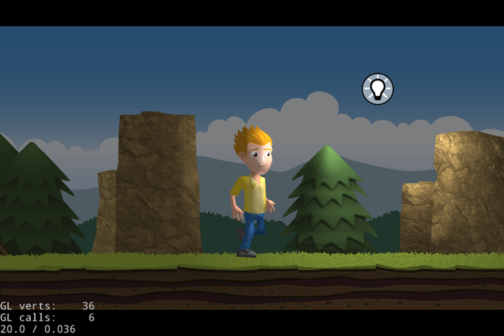

Cocos2d-x dynamic lighting demo
---

This simple Cocos2d-x project demonstrates how to

- load sprite frames from a sprite sheet
- create an animation
- initialize a point light effect with a normal map
- and enlighten your animation

Here's the full tutorial: [2d dynamic lighting with Cocos2d-x](https://www.codeandweb.com/blog/2015/05/12/lighting-demo-cocos2d-x)

